# Digital Legacy

A place to write things you want read after you are gone, and to make sure nobody reads them
before then.

The app produces twenty-four ordinary English words. Those words are the key. Everything written
here is locked with them and cannot be unlocked by anything else. The words are not stored in the
app, or on any server — there are no servers. They exist only wherever they were written down.

So the app can be opened, looked through, copied off the device, even handed to a stranger, and it
gives nothing away. Whoever holds the words holds everything.

**Writing never asks for the words. Reading always does.** You can add to the vault any day of your
life without the phrase in your hand; without it, nobody — including you — can read a single
character back.

---

## What it is for

Someone wants to leave a letter for a partner, instructions for whoever handles the house, or an
explanation that should not be readable while they are alive. The usual options all leak: a notes
app syncs, an email sits in a provider's index, a sealed envelope in a drawer is opened by whoever
finds it first.

This is closer to writing a will than to using a crypto wallet, and the app is built that way:
dignified, slow, and honest about what it cannot do.

- **No account, no server, no network.** After the first load the app makes no requests of any kind.
- **No recovery.** No reset link, no support address, no back door. A lost phrase is a lost vault.
- **No trigger.** It cannot know you have died. Someone has to be given the words.
- **Two secrets, if you want them.** An optional passphrase lets you give the words to one person
  and the passphrase to another, so neither can read anything alone.
- **Up to three vaults on one device**, each with its own twenty-four words and its own messages —
  one for a partner, one for the executor, one for whoever it turns out to be. A vault can carry a
  nickname, which stays on the device and is never written into a backup.
- **English and Thai**, light and dark, offline for as long as the device keeps working.

It is deliberately boring, and built to outlast whoever made it.

---

## Screenshots

Captured from the running app by `node tools/screenshots.mjs`, against a throwaway vault. Nothing
below is a mockup. Dark variants of every screen are in [`docs/screenshots`](docs/screenshots).

### It refuses to run in a browser tab

| Install gate | Before you begin |
|---|---|
| 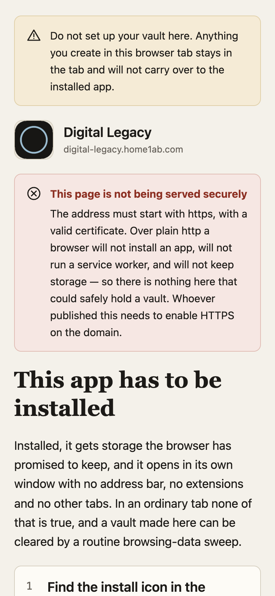 | 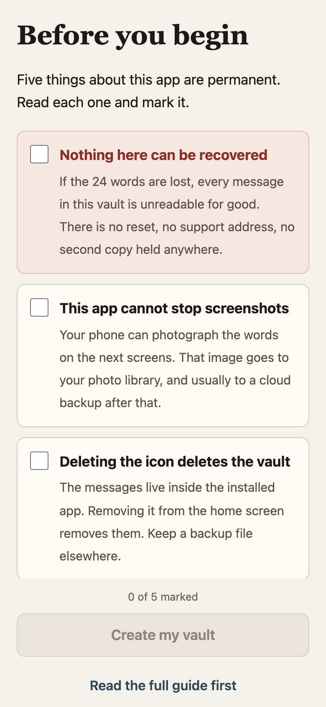 |

iOS gives a home-screen app a storage container separate from Safari, so a vault created in a tab is
stranded. The app renders only the install guide until it is running installed. The five permanent
facts must each be acknowledged individually before a vault can exist.

### Setting up

| Passphrase, or not | Four words at a time |
|---|---|
| 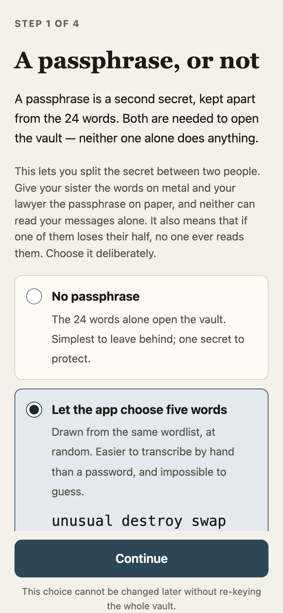 | 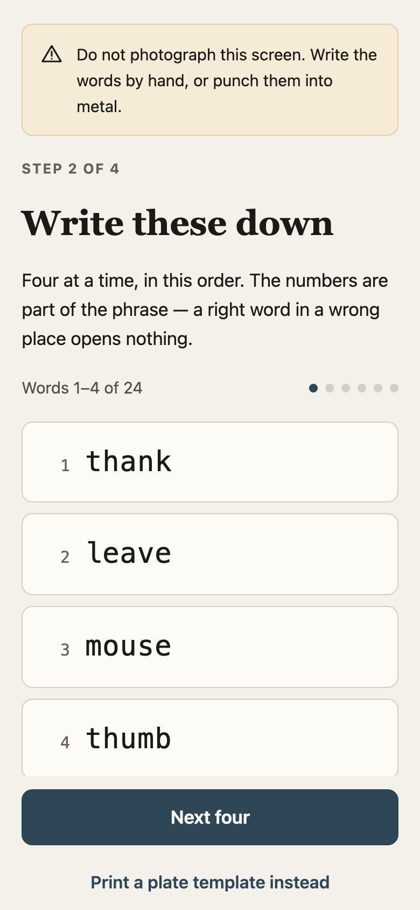 |

| Working out the key | Prove you wrote them down |
|---|---|
| 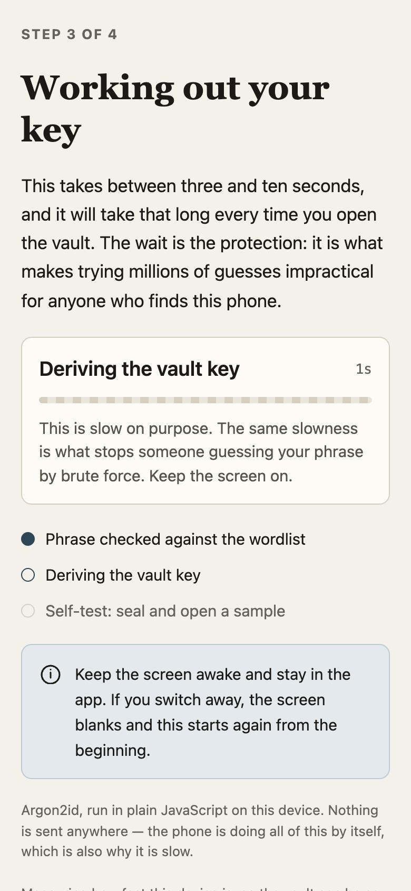 | 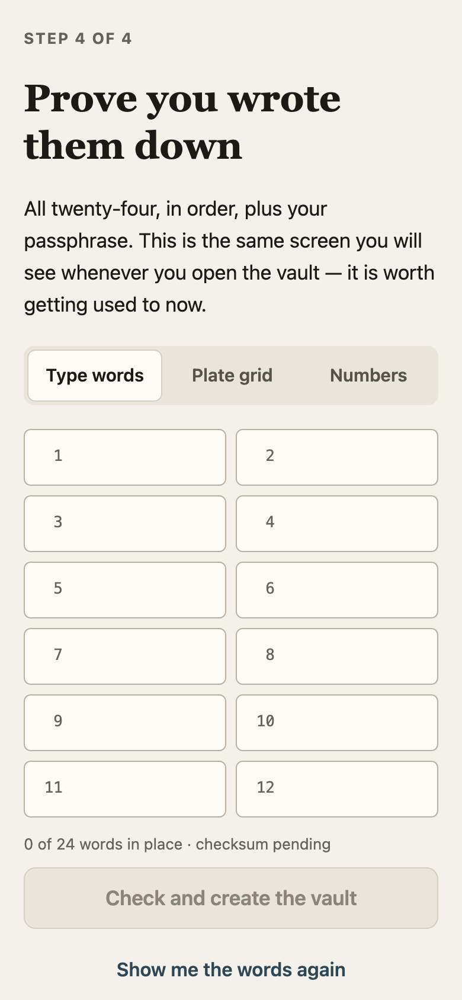 |

The phrase is shown four words at a time and never all at once. There is no copy button, no share,
no "save to Photos", and text selection is off. Then you re-enter all twenty-four — the vault is not
created until you have proved the words left the screen and reached paper or metal.

### Every day after that

| The locked vault | Writing |
|---|---|
| 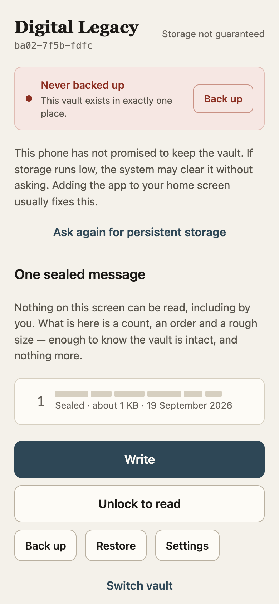 | 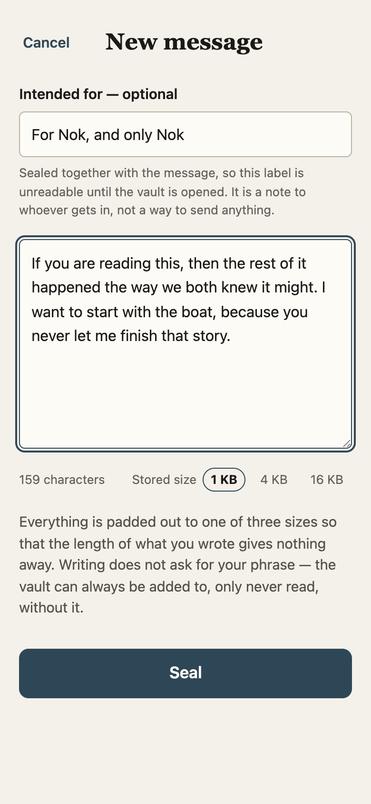 |

The everyday state shows a count, an order and a rough size. No previews, because there is nothing
to preview — the app genuinely cannot read what is there. Writing asks for nothing.

### More than one vault

| The picker | Naming one |
|---|---|
| 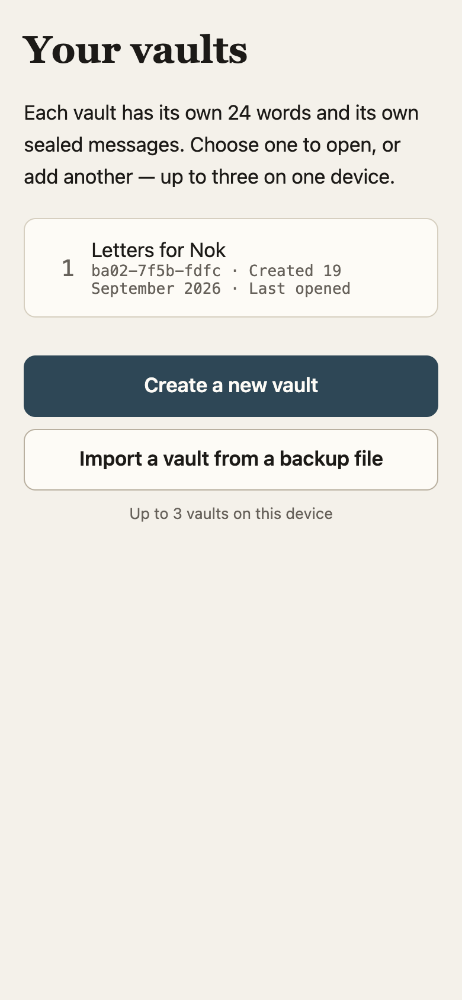 | 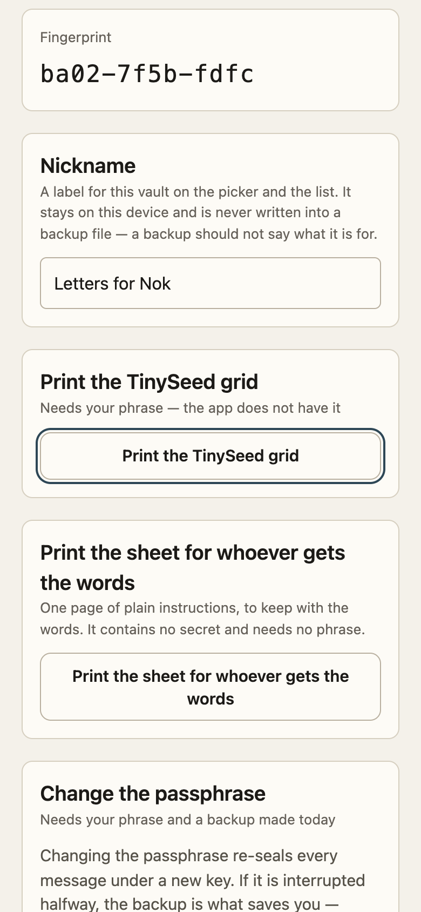 |

A device with any vault on it boots into this screen. Each row is a vault — nickname if it has one,
fingerprint always, the day it was made. Below: create another, or import one from a backup file.
Both go quiet at three. A vault's nickname is set in its Settings and lives only on that device: the
backup file must not say what a vault is for, so it does not carry the name.

### Reading

| Type the words | Or tap a metal plate |
|---|---|
| 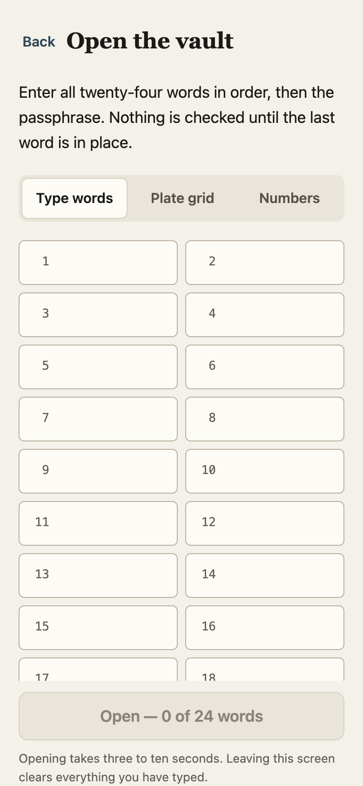 | 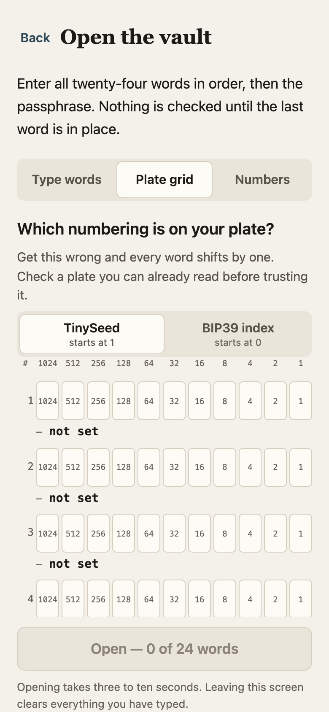 |

| Open, with the clock running | What the task switcher sees |
|---|---|
| 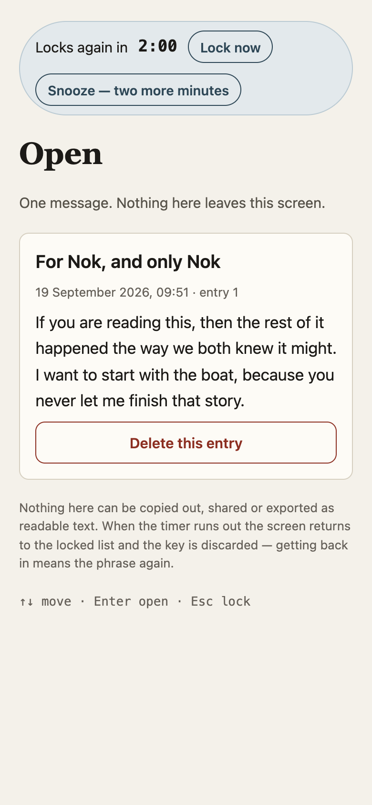 | 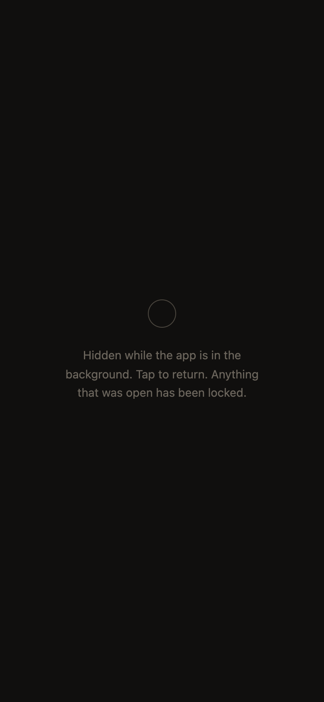 |

Three input modes, one validator: type them, tap the punched squares off a TinySeed plate, or enter
the numbers. A visible clock counts down from the moment the vault opens; **Snooze** buys two more
minutes, as often as needed, for as long as the screen stays open — scrolling and tapping buy
nothing. The moment the app leaves the foreground, the decrypted text is **removed from the page**
and the key is destroyed.

### The two pages it prints

| For punching a metal plate | For whoever is given the words |
|---|---|
| 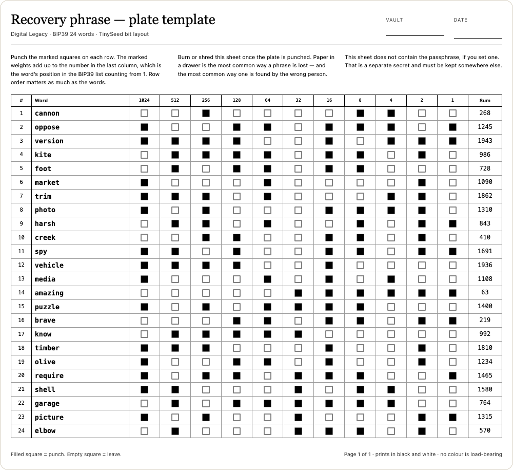 | 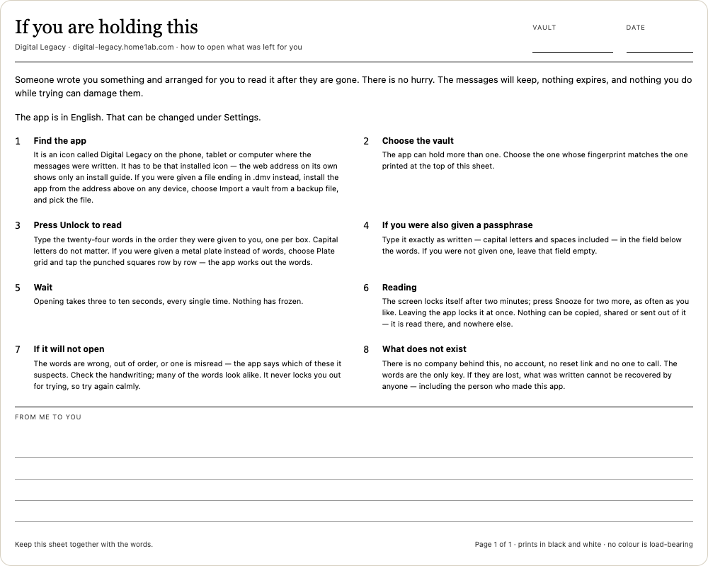 |

The plate template is an A4/Letter sheet for punching a metal plate. Black on white, no colour
carrying meaning, and the punched squares are drawn as vector fills rather than background colour
so a printer set to skip backgrounds still produces a correct plate.

The sheet for the heir is the page nobody thinks to make: eight plain steps for a person who has
never seen the app and is not having a good day — where the app is, that it must be the installed
icon, which vault, what to type where, that the ten-second wait is normal, what to do if it will not
open, and that there is nobody to call. It carries no secret, needs no phrase to print, and is meant
to be kept *with* the words, so whoever finds them knows what they are for. Ruled lines at the
bottom are for a note in your own hand.

### Backup, settings, guide

| Back up | Settings | Guide |
|---|---|---|
| 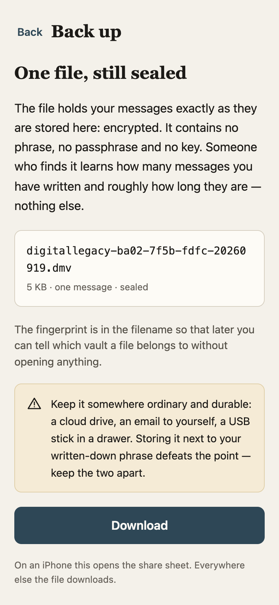 |  | 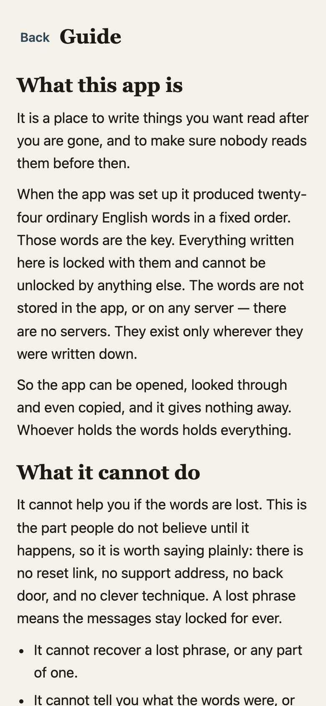 |

---

## Why and how it is secure

### What it defends against

| Threat | How |
|---|---|
| Someone takes the phone, unlocked | The vault is a separate lock. Nothing is readable without the phrase, and the phrase is not on the device. |
| Someone images the storage | Only ciphertext, public keys and a salt are on disk. There is no wrapped key to attack. |
| Someone guesses the phrase | Argon2id at 128 MiB, tuned on the device so each attempt costs seconds. Guessing is priced, not merely discouraged. |
| Someone steals a backup file | The file holds exactly what the device holds: sealed entries. It contains no phrase, no passphrase and no key. |
| Someone records traffic now to break later | Every entry is sealed to X25519 **and** ML-KEM-768 at once. Breaking one is not enough. |
| Someone compromises the site | One dedicated origin, no CDN, no external anything, a strict CSP, and a published hash per release. |
| Someone shoulder-surfs, or the OS screenshots the app | Backgrounding removes decrypted content from the page and destroys the key. |
| A bug tries to phone home | `connect-src 'none'` — the page cannot open a network connection at all. |

### What it does not defend against, and says so

A compromised device — a keylogger, a malicious keyboard, a jailbreak — sees the phrase as you type
it. Screenshots cannot be blocked by a web app. Someone standing behind you can read the screen.
And nothing here protects against you losing the words, which is the most likely way this ends
badly. The app says all of this in plain language, on screen, before a vault exists.

### The key schedule

```
mnemonic (NFKD) + passphrase (NFKD)
  seed   = PBKDF2-HMAC-SHA512(mnemonic, "mnemonic" + passphrase, 2048, 64)      BIP39
  master = Argon2id(seed, meta.kdf.salt, m/t/p from meta.kdf)                   pure JS, in a Worker
    HKDF-SHA256(master, "dm/v1/x25519",   32) -> X25519 private key
    HKDF-SHA256(master, "dm/v1/mlkem768", 64) -> ML-KEM-768 keygen seed
```

Entropy is 256 bits from `crypto.getRandomValues`, turned into 24 words with a BIP39 checksum. The
HKDF labels are domain-separated, so the two keys can never collide or be substituted for each
other.

**The Argon2id cost is measured on the device that will open the vault, at setup, and frozen.** One
pass is timed and `t` chosen so a full derivation costs about four seconds *there*, capped at 12.
Memory is 128 MiB, dropping once to 64 MiB and recording that if the larger allocation fails. This
is why opening takes three to ten seconds every single time, and the app explains that rather than
hiding it. The RFC 9106 test vector runs at every boot; a mismatch stops the app before it touches
the vault.

### Each message is sealed twice over

```
(ctPq, ssPq) = ML-KEM-768.encapsulate(pkPq)
eph          = X25519 ephemeral;  ssC = X25519(ephPriv, pkC)
key = HKDF-SHA256(ssC ‖ ssPq, salt = ∅, info = "dm/v1/entry" ‖ ephPub ‖ ctPq ‖ pkC ‖ pkPq, 32)
AES-256-GCM(key, random 96-bit nonce, AAD = v ‖ id ‖ seq ‖ day)
```

The entry key is derived from **both** shared secrets. It stays secret if either X25519 or
ML-KEM-768 holds, which is the defence against harvest-now-decrypt-later over a horizon measured in
decades. The whole unencrypted header is authenticated, so none of it can be edited undetected.
The AES key is imported `extractable: false` — once inside WebCrypto it cannot be read back out.

Sealing needs only the public keys, so **the write path never has a seed in memory at all**.

### What a locked vault gives away

Plaintext is framed and zero-padded to a 1 KB, 4 KB or 16 KB bucket, so ciphertext length reveals
only the bucket. Exact timestamps are inside the sealed payload; only day granularity is stored in
clear. An attacker with the device or a backup file learns how many messages exist, roughly how long
they are, and which days they were written. Nothing else — not a recipient, not a subject, not a
word. A vault's nickname is deliberately left out of the backup file for the same reason; it exists
only in the device's own storage.

### Where secrets live, and how they stop living

The phrase and passphrase exist during exactly two operations: setup and unlock. Never during a
write.

Private keys exist in **one place only** — a dedicated Web Worker. The worker derives the seed
itself, so the seed never touches the main thread. Locking is `worker.terminate()`: the entire heap
is discarded, which is a stronger guarantee than a `fill(0)` the JIT is free to optimise away.
Zeroing is still done everywhere, as belt.

Locking happens on `visibilitychange`, on `pagehide`, on Escape from anywhere, on desktop window
blur, and on a visible countdown that starts when the vault opens and is not extended by scrolling
or tapping — only by a deliberate Snooze. Backgrounding also empties the DOM — the content is
removed, not blurred or covered, so it cannot appear in a task-switcher thumbnail. The one
exception: while the backup or restore screen has a share sheet or file chooser open, which Android
reports as the page going hidden, blanking is held off — those two screens hold nothing decrypted.

Setup is blanked the same way, but the phrase itself is not thrown away for a phone call: it
survives in memory for up to ten minutes in the background, so you come back to the same words on
the same page. Longer than that and it is wiped and the phrase starts again, with the screen saying
why. The screen was empty the whole time either way.

Phrase fields are never `<input type="password">`: a password field makes the browser and every
password manager offer to remember the phrase, which is precisely what must not happen. They carry
no name and have autocomplete, autocorrect, autocapitalise and spellcheck off.

### Delivery and supply chain

- One dedicated origin. Nothing else is ever served from it.
- `default-src 'none'`, `script-src 'self'`, **`connect-src 'none'`**, `form-action 'none'`,
  `base-uri 'none'`, `object-src 'none'`. No `unsafe-inline`, no `unsafe-eval`.
- Every dependency vendored, pinned and committed unminified so it stays auditable. No CDN, no WASM.
- No `innerHTML`, no `eval`, no template strings of markup anywhere — the DOM is built node by node
  with `textContent`, so there is nothing for an injection to ride in on.
- A service worker that caches offline but **never activates a new version on its own while a vault
  exists**. An update waits until someone approves it, on a screen showing both release hashes. With
  no vault on the device there is nothing to protect, and a newer worker is adopted at once.
- `node tools/build.mjs` publishes a SHA-256 per file and one release hash, which the app shows in
  Settings so it can be compared against what is published. The manifest verifies with stock tools:
  `grep -v '^release ' SHA256SUMS | shasum -a 256 -c`

`node tools/audit.mjs` enforces most of this mechanically and fails the build on a violation.

### When something goes wrong

There is no telemetry and no server, so a fault has nowhere to go but the screen. Any uncaught error
locks the vault and replaces the view with a crash screen carrying the message, a short stack, the
route and the boot diagnostics — selectable, so it can be written down. No message, phrase or
passphrase ever reaches that screen. Reloading recovers.

---

## Layout

```
index.html              shell, meta CSP, the blank overlay and the print sheet
app.css                 design tokens, both themes, every component
manifest.webmanifest    installability
sw.js                   cache-first, version-pinned, never self-activates
js/
  main.js               view registry, framebusting, boot
  app.js                state, routing, install gate, blanking, locking, crash reporting
  vault.js              the whole cryptosystem (the only file that imports vendor/)
  keyworker.js          the only place private keys exist
  keys.js               main-thread handle on that worker; terminate() is the wipe
  codec.js              zeroing, constant-time compare, base64, AAD, padded plaintext frame
  db.js                 IndexedDB "dm" v2 — up to three vaults, every entry stamped with its vault
  i18n.js, strings.js   EN + TH catalogues, Buddhist-era dates, Arabic digits everywhere
  dom.js, ui.js         textContent-only DOM building; the component library
  phrase-entry.js       three input modes, one validator
  deriving.js, held.js  derivation screen; the short-lived phrase hold for the plate print
  views-*.js            screens, grouped as gate / genesis / vault / unlock
vendor/noble.js         pinned, bundled, auditable
tools/                  build, tests, audit, screenshots (dev only — not deployed)
docs/                   screenshots for this README
```

Deploy everything except `tools/`, `docs/`, `requirement.md` and the design canvas.

## Build and verify

```sh
cd tools && npm ci && cd ..
./tools/check.sh              # all of the below, in the order that fails fastest

node tools/build.mjs          # bundle vendor/, stamp the release hash, write SHA256SUMS
node tools/audit.mjs          # CSP, no innerHTML/eval/fetch/clipboard/password-field
node tools/check-imports.mjs  # module graph, view registry, service-worker precache list
node tools/check-strings.mjs  # en/th parity, placeholders, Arabic digits, no markup
node tools/test.mjs           # crypto round trip, AAD tampering, padding buckets, RFC 9106
node tools/plate-preview.mjs  # renders the plate sheet, fails if it does not fit one page
node tools/e2e.mjs            # genesis -> write -> unlock -> read -> backup -> restore, in Chrome
node tools/screenshots.mjs    # regenerates docs/screenshots from the running app

tools/release.sh 1.0.1 msg.txt   # bump js/version.js, run check.sh, publish to main, tag v1.0.1
```

Every push to `main` is a release: the version in `js/version.js` is bumped, the commit is tagged
`v<version>`, and the tag message carries the release hash from `SHA256SUMS` — the same hash the
app shows in Settings — so a device can be matched to the exact tag it is running.

Pinned: `@scure/bip39@2.4.0`, `@noble/hashes@2.4.0`, `@noble/curves@2.4.0`,
`@noble/post-quantum@0.7.1`.

## Deviations from `requirement.md`, and why

1. **AAD includes `day`.** The spec lists `header{v, id, seq}`. `day` is stored in clear and would
   otherwise be editable without detection. Including it is strictly stronger and costs nothing.
2. **The worker derives the BIP39 seed itself** rather than receiving it as a transferred
   `ArrayBuffer`. The words have to cross the boundary either way; deriving in the worker means the
   seed never exists on the main thread at all, and `terminate()` is a stronger wipe than `fill(0)`.
3. **`worker-src 'self'` and `child-src 'self'` added to the CSP.** With `default-src 'none'` and no
   `worker-src`, the key worker cannot start at all.
4. **The "second vault in the browser" warning lives on the install gate**, not inside the installed
   app. The two storage containers are deliberately separate, so the installed app cannot see the
   browser one. The gate can, and does.
5. **The visible relock countdown is the only idle timer.** A second, invisible timer contradicting
   the visible one is worse than none. Default 120 s; 60 / 120 / 300 / manual.
6. **Desktop `blur` blanks the screen; mobile does not** — on a phone, blur fires for the share sheet
   and the file picker. A flag suppresses it around those on desktop too.
7. **Passphrase masking uses `-webkit-text-security`.** Where unsupported the field stays legible and
   says so, because the alternative — a password field — makes every manager offer to remember it.
8. **No `file://` bundle.** Browsers block module scripts and workers from `file://`, and IndexedDB
   there is per-file and unreliable, so such a build would not run and its storage would not be a
   vault. The equivalent is: verify the release against `SHA256SUMS` and serve it from localhost.
9. **Thai is complete — 505 of 505 keys — but not reviewed by a first-language reader.** Treat `th`
   in `js/strings.js` as a full draft awaiting sign-off. `check-strings.mjs` enforces the mechanical
   rules; it cannot judge the prose.

## Deployment checklist

Code alone does not give you the threat model above.

- [ ] Dedicated origin. Nothing else on `digital-legacy.home1ab.com`, ever.
- [ ] `CAA 0 issue "letsencrypt.org"` on the zone, and `CAA 0 iodef` to an address you read.
- [ ] DNSSEC signed.
- [ ] Registrar lock and MFA on the registrar account.
- [ ] The hostname excluded from any wildcard certificate used elsewhere on `home1ab.com`.
- [ ] `CNAME` file in the repo root if this is served from GitHub Pages, and HTTPS enforced.
- [ ] Publish `SHA256SUMS` and the release hash next to the download.
- [ ] Branch protection, signed commits, and 2FA on every account that can push.

GitHub Pages cannot set response headers, so the CSP is a `<meta>` tag and `frame-ancestors` is
unavailable — `js/main.js` refuses to render inside a frame instead. On a host that can set headers,
add the CSP as a real header too, plus `Strict-Transport-Security`, `X-Content-Type-Options:
nosniff` and `Cross-Origin-Opener-Policy: same-origin`.

## Known gaps

- The Thai catalogue is complete but unreviewed. A first-language read-through, on a device, at
  100 % and 200 % text size, is the one thing that must happen before launch.
- Boot verifies entry *structure*; seals are verified cryptographically at unlock, because verifying
  a seal requires the key. The damaged-vault screen reports whichever check found the problem.
- The checksum-failure screen lists positions worth re-checking. It is a heuristic and says so — the
  app does not know the right words.
